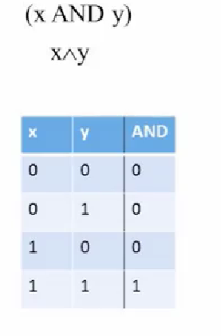
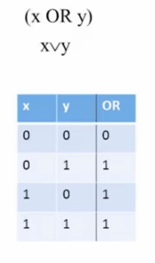
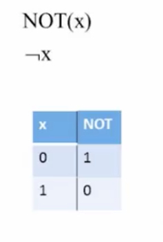

## Boolean Algebra

### X AND Y

### X OR Y

### NOT X

## commutative

(X AND Y) = (Y AND X)
(X OR Y) = (Y OR X)

## distributive

(X AND (Y OR Z)) = (X AND Y) OR (X AND Z)
(X OR (Y AND Z)) = (X OR Y) AND (X OR Z)

## de morgans laws

NOT(X AND Y) = NOT(X) OR NOT(Y)
NOT(X OR Y) = NOT(X) AND NOT(Y)
